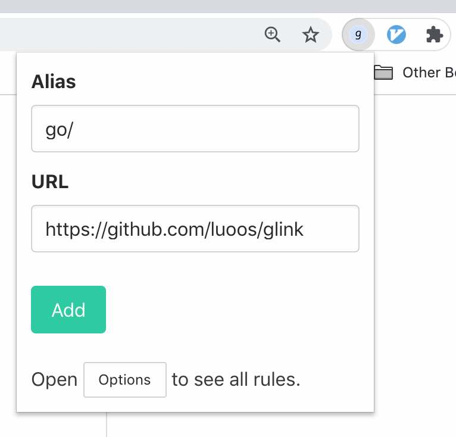
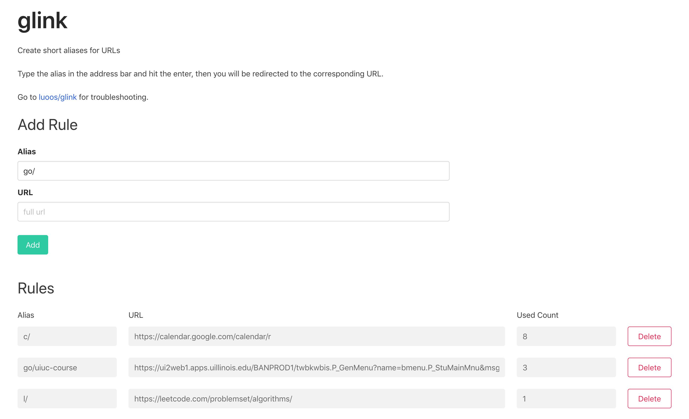
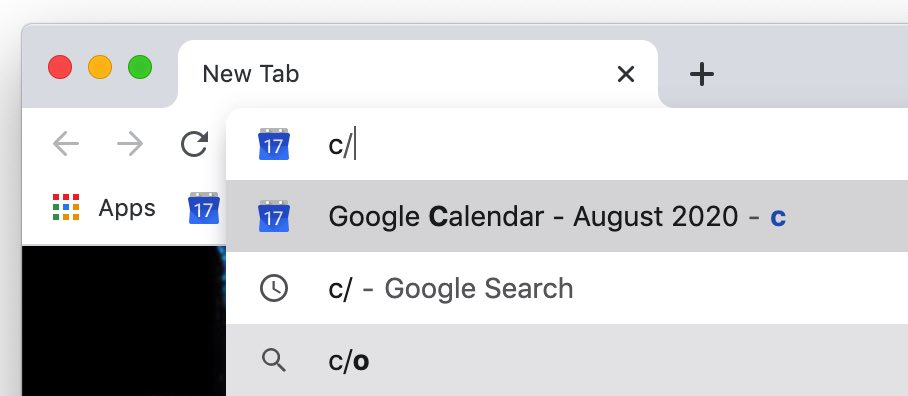

# glink

Chrome extension to create aliases for URLs. Then you just enter a short alias to go to certain page.

For example,

1. type `c/` to go to [Google Calendar](https://calendar.google.com/calendar/r)
2. type `y/` to go to [Youtube](https://calendar.google.com/calendar/r)
3. type `xxx/yyy` to go to certain page

You can customize all these rules.

Recommendation:

1. Use one-character aliases for the most frequent pages. Like `c/` for Google Calendar
2. Use aliases start with `go/` for less frequent pages. Like `go/doc-xxx` for Google docs

## Install

Install on Chrome Web Store. (TBD)

## Configure Rules

### 1. Add rules

Click the icon to open the popup. You will see a form with `Alias` and `URL` as inputs.

1. By default, the alias starts with `go/`. It's a template. You can change it if you want.
2. The `URL` is the URL of current tab. You can also change it if you want.
3. For aliases with only characters (no slash `/`), a slash will be appended, because we want explicitly differentiate the alias from a search engine keyword. For example, if you type `bi` in the address bar, it could be either the alias or a keyword to search.

Then click the `Add` if everything looks good.

### 2. View rules and Delete rules

Click the `Options` button on the popup to open the options page. You can see all rules and delete rules there.

### 3. Use alias

After adding rules, you can just type alias in the address bar and hit `Enter`, you will then be redirect to the corresponding URL.

## Troubleshooting

Please use the [issue tracker](https://github.com/luoos/glink/issues) for troubleshooting.

## License

Copyright Jun Luo, 2020

Apache 2.0