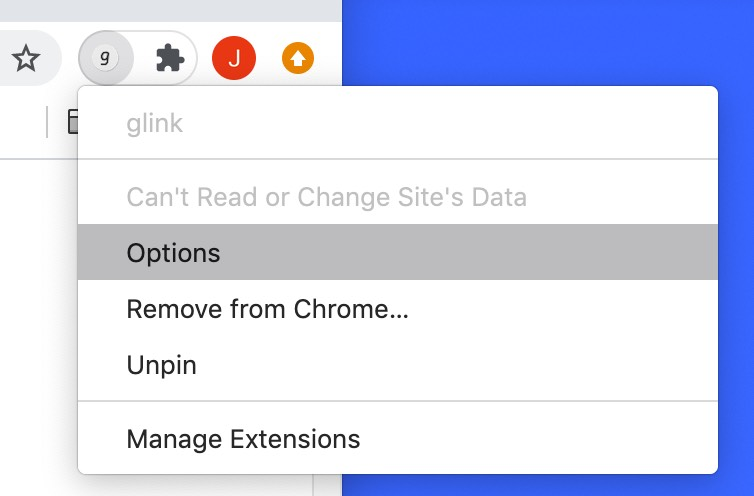

# glink

Chrome extension to create aliases for URLs. Then you just enter a short alias to go to certain page.

For example,

1. type `c/` to go to [Google Calendar](https://calendar.google.com/calendar/r)
2. type `y/` to go to [Youtube](https://calendar.google.com/calendar/r)
3. type `xxx/yyy` to go to certain page

You can customize all these rules.

Recommendation:

1. Use one-character aliases for the most frequent pages. Like `c/` for Google Calendar
2. Use aliases start with `go/` for less frequent pages. Like `go/doc-xxx` for Google docs

## Install

Install on Chrome Web Store. (TBD)

## Configure Rules

### 1. Right click the glink icon and click `Options`

### 2. Add rules

Notes:
1. By default, the alias starts with `go/`. It's a template. You can remove it if you want.
2. For aliases with only characters (no slash `/`), a slash will be appended, because we want explicitly differentiate the alias from a search engine keyword. For example, if you type `bi` in the address bar, it could be either the alias or a keyword to search.

After adding rules, you can just type alias in the address bar and hit `Enter`, you will then be redirect to the corresponding URL.

## TODO

1. Use a popup to quick add a rule for the current tab.

## License

Apache 2.0